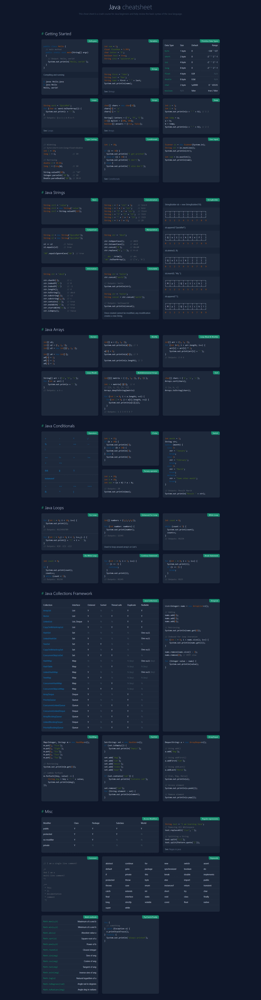

# 2DAM

Este repositorio está dedicado para almacenar apuntes y tareas en mi formación de Desarrollo de Aplicaciones Multiplataforma, (específicamente, el segundo curso).

## Asignaturas

1. [**Desarrollo de interfaces (DAD)**](./desarrollo-de-interfaces/README.md)
2. [**Acceso a datos (AED)**](./acceso-a-datos/README.md)
3. [**Programación multimedia y dispositivos móviles (PGL)**](./programacion-multimedia-y-dispositivos-moviles/)
4. [**Programación de servicios y procesos (PGV)**](./programacion-de-servicios-y-procesos/README.md)
5. [**Sistemas de gestión empresarial (SSG)**](./sistemas-de-gestion-empresarial/)

## Java Cheatsheet

