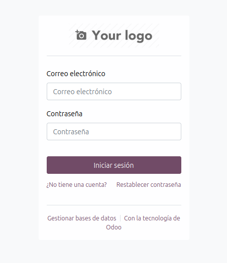
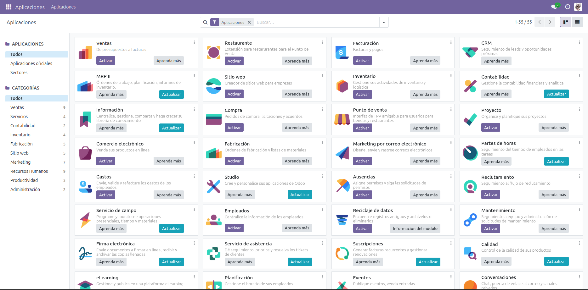
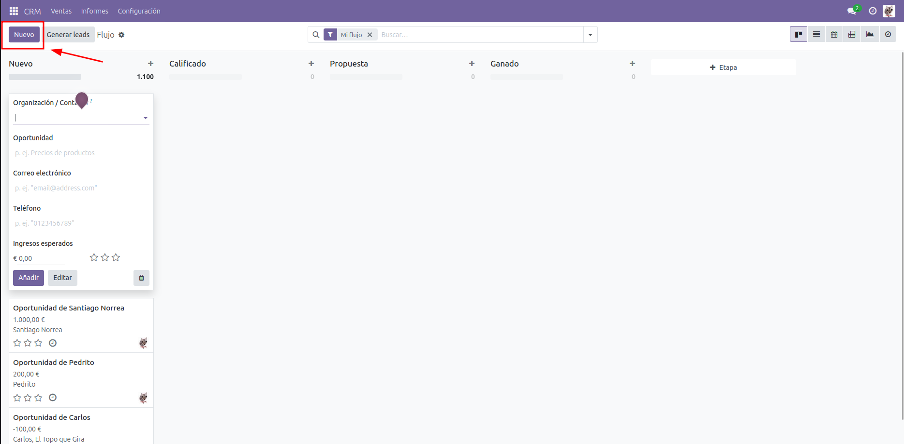
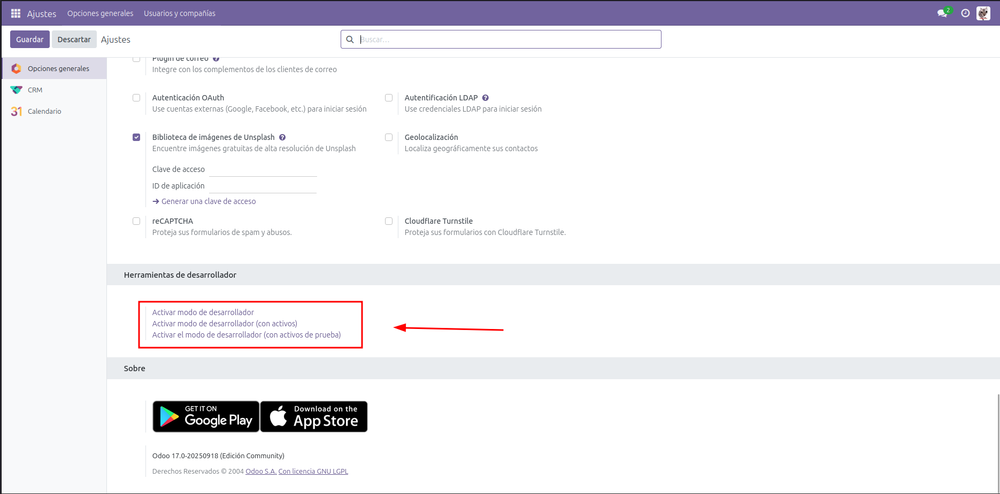

<div align=justify>

# Instalación de Odoo a través de Docker Compose

<div align=center>
    
</div>

# Tabla de contenidos

- [Paso 1 - Construir y levantar el proyecto con Docker Compose](#paso-1---construir-y-levantar-el-proyecto-con-docker-compose)
- [Paso 2 - Creamos una cuenta e iniciamos sesión](#paso-2---creamos-una-cuenta-e-iniciamos-sesión)
- [Paso 3 - Aplicaciones: CRM y creación de clientes](#paso-3---aplicaciones-crm-y-creación-de-clientes)
- [Paso 4 - Habilitar opciones de desarrollador](#paso-4---habilitar-opciones-de-desarrollador)
- [Paso 5 - Cerrar la aplicación](#paso-5---cerrar-la-aplicación)


## Paso 1 - Construir y levantar el proyecto con Docker Compose

De los archivos pasados para lanzar Odoo:

```
dev
├── docker-compose.yml
prod
├── docker-compose.yml
```

Nos situamos en el directorio donde se encuentra el archivo `docker-compose.yml` de la versión o tipo necesario (`development` o `production`), y ejecutamos:

```bash
# Para construir el proyecto (si hace falta) y levantarlo en segundo plano.
docker compose up -d --build 
```

Esto nos crea la carpeta `volumesOdoo` con todo lo necesario para correr Odoo en nuestro sistema. Una vez construido y levantado el proyecto Docker, accedemos a él a través de [localhost:8096](localhost:8096) o [localhost:8070](localhost:8070) (dependiente de si es la versión `dev` o `prod`).

## Paso 2 - Creamos una cuenta e iniciamos sesión

</div>

> [!NOTE]
> Hay que destacar que hice el procedimiento de crear una cuenta antes de enterarme que había que documentar todo ello (disculpe). PERO, como soy una persona atenta que deja mensajitos en bonitas alertas de colores como esta, procuraré explicar el procedimiento de forma clara.

<div align=justify>

1. Odoo nos asignará una contraseña maestra (que puede cambiarse) que debemos almacenar en un lugar seguro.
2. Insertamos nuestros datos como nombre de usuario, correo electrónico y contraseña.
3. Una vez creada la cuenta, debemos iniciar sesión en la siguiente pantalla cuando intentemos volver a acceder.

<div align=center>
    
</div>

## Paso 3 - Aplicaciones: CRM y creación de clientes

Una vez accedemos a Odoo, este nos arrojará al *homepage* de Odoo donde nos mostrarán los módulos instalados y disponibles de la aplicación. Debemos instalar el módulo CRM.

<div align=center>
    
</div>

Y dentro de nuestro módulo CRM debemos crear 3 clientes ficticios, utilizando un formulario simple como el que se muestra a continuación:

<div align=center>
    
</div>

## Paso 4 - Habilitar opciones de desarrollador

Por último, como algo requerido en la práctica, debemos habilitar las opciones de desarrollador de la aplicación. Para ello debemos acceder a "ajustes" (por medio del menú lateral), y al final de la pantalla de ajustes, seleccionar una de las opciones deseadas que permite habilitar las opciones.

<div align=center>
    
</div>

## Paso 5 - Cerrar la aplicación

Si la aplicación fue lanzada en segundo plano y no vamos a seguir utilizando la *app*, debemos apagar el servicio con:

```bash
docker compose down
```

Podemos comprobar si sigue activo buscando el servicio con:

```bash
docker compose ls
```

</div>